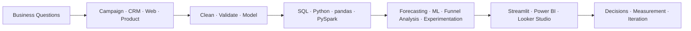

<h1 align="center">Hi, I'm Mohit Kumar 👋</h1>

  <strong>Data & Marketing Analytics · Forecasting · Applied Machine Learning · Analytics Engineering</strong>

  I build analytics systems that turn campaign, customer, web, and operational data into forecasts, dashboards, and clear business decisions.

  

---

## What I Work On

- **Predictive analytics and machine learning:** Build classification, forecasting, and campaign-response models using time-based validation, feature engineering, scenario analysis, and business-focused model evaluation.

- **Marketing, CRM, and growth analytics:** Analyze customer journeys, campaign engagement, conversion funnels, web behavior, SEO performance, and attribution across CRM, email, digital marketing, and web analytics environments.

- **Analytics engineering:** Develop reliable data transformations, dimensional models, reusable metric layers, data-quality checks, and analysis-ready datasets that support scalable reporting and decision-making.

- **Business intelligence and data storytelling:** Create decision-focused dashboards, automated reporting workflows, and executive-ready insights using Power BI, Qlik Sense, Looker Studio, Streamlit, and Excel.

- **Product and behavioral analytics:** Explore user behavior, journeys, segmentation, retention, and experimentation concepts using tools such as Amplitude, GA4, and Adobe Analytics.

- **AI-enabled analytics:** Build analytics agents and AI-assisted workflows for data validation, insight generation, reporting automation, predictive modelling, and analytical quality assurance.

- **Analytics leadership:** Translate complex analysis into clear business recommendations, collaborate with cross-functional teams, improve reporting processes, and support the development of junior analysts.

---

## Tech Stack

### Data, Modeling & Engineering

### Analytics, BI & Delivery

### CRM Platforms

---

## How I Approach Analytics

I start with the decision, define trustworthy metrics, validate the data, choose the simplest useful analytical method, and make the result easy to act on.

---

## Selected Work

### Campaign Performance Prediction

End-to-end portfolio system for forecasting telecom email campaign engagement using fully synthetic data.

- Built campaign-level scoring for expected opens and clicks with Ridge, Random Forest, and Gradient Boosting models.
- Used a chronological holdout to preserve real forecasting conditions and reduce leakage risk.
- Added monthly Prophet forecasts, seasonal baselines, validation reports, model QA, and scenario downloads.
- Delivered an interactive Streamlit planning dashboard plus reproducible training and smoke-test workflows.
- Selected Gradient Boosting achieved holdout R² of **0.6045 for open rate** and **0.5791 for click rate** on synthetic data.

`Python` · `pandas` · `scikit-learn` · `Prophet` · `Streamlit` · `Matplotlib`

### ETL Automation

- Cross-platform Python ETL pipeline that transforms recurring email campaign workbooks into clean, standardized, analysis-ready datasets on Windows and macOS.
- Automates Excel ingestion, data cleaning, schema validation, transformation, and consolidated report generation.
- Supports multiple business streams through configurable JSON and environment-based settings.
- Standardizes campaign metrics, date fields, naming conventions, and percentage formatting across source files.
- Preserves original workbooks and archives them only after successful processing.
- Includes shared setup logic, Windows and macOS execution scripts, automated tests, cross-platform CI, and project health checks.
- Uses anonymized sample configurations and excludes credentials, client data, and sensitive business identifiers.

### Growth Analytics & Measurement

Analytics-first framework for helping small and midsize businesses find broken tracking, identify funnel leaks, and prioritize growth decisions.

- Connects GA4/GTM measurement, SEO visibility, CRM pipeline analysis, and conversion reporting.
- Defines practical diagnostics, KPI frameworks, dashboard deliverables, and measurement guardrails.
- Focuses reporting on qualified leads and business outcomes rather than surface-level traffic metrics.

`GA4` · `Google Tag Manager` · `Search Console` · `SEMrush` · `Salesforce` · `Power BI` · `Looker Studio`

---

## Current Focus

- Building production-minded forecasting workflows with explicit validation, reproducibility, and monitoring.
- Deepening PySpark and Spark SQL skills for scalable analytics engineering.
- Connecting marketing measurement to CRM outcomes and revenue decisions.
- Turning technical analysis into clear dashboards, documentation, and operating recommendations.

---

## Additional Academic Projects

### Manpower Demand Forecasting

Forecasting project focused on anticipating workforce demand and potential skill shortages.

- Explored labor-market, industry, and workforce data through Jupyter-based analysis.
- Applied data cleaning, exploratory analysis, forecasting, and neural-network concepts.
- Framed outputs around workforce planning, resource allocation, and shortage preparedness.

`Python` · `Jupyter Notebook` · `Artificial Neural Networks` · `Forecasting` · `EDA`

### Applied Machine Learning Portfolio

Cross-domain machine-learning work spanning healthcare, retail demand, and computer vision.

- Cardiovascular risk analysis using patient characteristics, daily habits, EDA, and predictive classification.
- Supermarket demand forecasting using historical sales data.
- CNN-based image classification for zebra versus non-zebra images.

`Python` · `pandas` · `NumPy` · `scikit-learn` · `Deep Learning` · `Data Visualization`
